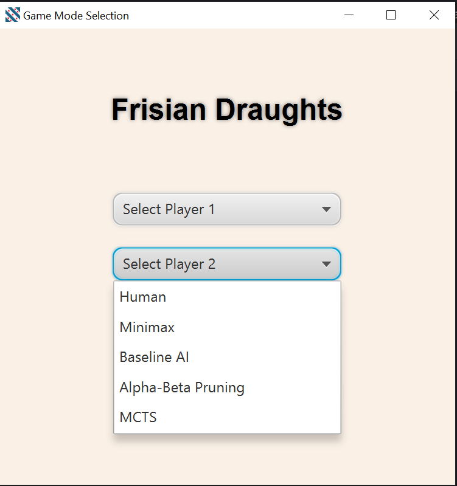
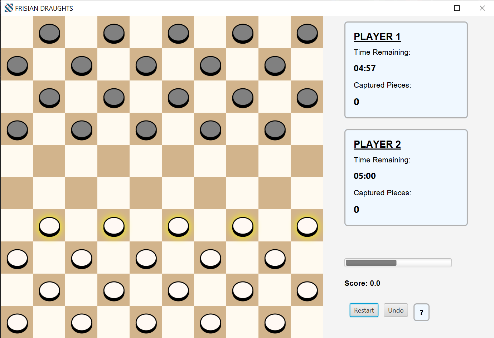

# Play it: Frisian Draughts

Our work on Project 2-1, academic course 2024/25  
@Maastricht University, Bsc. Data Science and AI

### **Quick start**_: Welcome to our game! Before running, the library JavaFx needs to be imported/added in Module Settings. To run the gameplay app, please execute the file `GUI.java` in the path src/main/java/org/testing/project_2_1_. For help about runnning the game, look at the section no. 5 on the table of contents.

# Table of Contents  
1. [Preface](#preface) 
2. [Rules](#rules)  
   - [Winning Conditions](#winning-conditions)  
   - [Draw Conditions](#draw-conditions)  
3. [Algorithms](#algorithms)  
   - [Adversarial Search](#adversarial-search)  
   - [Machine Learning](#machine-learning)
   - [Hybrid Approach](#hybrid-approach)     
4. [Project Structure](#project-structure)  
   - [Main Classes](#main-classes)  
   - [Supporting Classes](#supporting-classes)  
5. [Running the Program](#running-the-program)  

## Preface  
This project aims to build a Java-based computer version of the board game
"Frisian Draughts", a variant of the classic game checkers, which originated in the north-western region of the Netherlands called Fryslân around 250 years ago (originally played on a 100-square board). This is a two-agent, zero-sum, perfect information game.
With help of the graphic library JavaFX, we designed a user-friendly UI which intends to enhance the player experience even from the beginner levels, highlighting possible moves to the user, and showing them other illegal moves, with the objective of being an experience in which the user can from his mistakes, undo moves, restart the game, and so eventually and progressively improve his proficiency.
For the intelligent player functionality, we built and thoroughly tested several artificial intelligence (AI) game-playing algorithm, including types of
adversarial search algorithms and one machine learning (ML) algorithm.

## Rules  
A game of Frisian Draughts is played by two people on a 10x10 squares board, where only the darker squares are used for the game.  
Twenty (20) black pieces are displayed in the first 4 rows of the board, and twenty (20) white pieces are displayed in the bottom 4 rows of the boards, giving a maximum number of 40 pieces in total for a single game.  

We establish the allowed moves/captures, constraints and regulations based on the Official Rules for Frisian Draughts (2011), such as:
-   Each piece moves (forward) only one square diagonally
  - A piece can capture (and must capture in a situation possible piece-capturing) if and only if an enemy piece is placed within a radius of one square (any direction) and the following square is that direction is free (an empty square). 
  - A piece is promoted to king when: any piece reaches the opposite king row (which is the first row on the opposition side)
    - A king piece is allowed to make simple moves, but also is allowed to move diagonally to any empty square. 
    - A king can make regular captures, but is also allowed to capture any enemy piece (in any direction) if and only if its linearly-following square is empty.
   
### Winning Conditions
- A player wins when their opponent has no valid moves left. This can occur in two situations:
   - The opponent has no pieces remaining on the board.
   - All of the opponent's pieces are blocked from moving by the player's pieces1.
- In an endgame with two kings against one king, the player with two kings must win within seven moves. If they fail to do so, the game is declared a draw14.
### Draw Conditions
- King vs. King: When both players are left with only one king each, the game is automatically declared a draw if neither king can capture the other on their next turn1.
- Two Kings vs. One King: If the player with two kings cannot win within seven moves, the game is a draw14.
- Three Kings Endgame: In a situation where there are only three kings left on the board (regardless of distribution), the game is drawn after both players have made two moves.
- No Threefold Repetition: Unlike some other board games, Frisian draughts does not have a draw rule for threefold repetition of positions2.

## Algorithms
### Adversarial Search.  
1. Minimax: A decision-making algorithm that recursively evaluates all possible moves in checkers, assuming perfect play by both players. It maximizes the player's minimum gain, minimizes maximum loss in zero-sum games, such as Frisian Draughts.
2. Alpha-Beta Pruning: An optimization technique for the Minimax algorithm that reduces the number of nodes evaluated in the game tree. It prunes branches that cannot influence the final decision, exponentially improving its time/space complexity, being able to set the depth of the tree as a parameter. Our agent `AlphabetaAgent.java` outperforms the rest of the intelligent agents, setting higher benchmarks after game simulations againts every single of the other agent, as we show be ruuning `Simulation.java`, which emulates two instances of an agents's class and keeps tracks of the number of wins after a _n_ number of simulations.  
3. Monte Carlo Tree Search (MCTS): Combines tree search with random sampling to evaluate moves in checkers. It balances exploration of new strategies with exploitation of known good moves, using Upper Confidence Bound (UCB) for tree traversal. We found MCTS to be rather computionally inefficient in the context of our checkers game, especially when compared to Alpha-beta pruning. MCTS seems to be a bigger improvements in such games where there exists randomness (such as card games) or lack of perfect information. Our agents using MCTS, `AgentMCTS.java` is still fully functional.
4. Proof-Number Search: A best-first search algorithm that efficiently proves or disproves positions in checkers. We wanted to use this algorithm to handle endgame situations, when it perform significantly better, we used an implementation based on the work by Mark Winands and Jaap van den Heik. PN Search is effective at very closed, tactical positions close to the end, but very inefficient at open-ended or start of the game positions. Basically, what PNS does is to evaluate each position as either win/loss, and it does this by assigning Proof Numbers, and Disproof numbers to specific positions to evaluate them. These numbers are certain values that verify when a position can be decided to be a win (proof) or a loss (disproof). The problem is that PNS, to avoid over-computatonal complexity, only focus in the most "critical" part of the tree (to reduce the state space), so it's very useful in situations when the game is stall and repetitive, but on contrary, PNS struggles  exploring positions where there is a lot of free space in the board (or a lot of possible moves and many pieces, like the start of the game), since the path to win/loss is highly unclear and, essentially, will fail to find any Proof or Disproof positions (this is basically the reason why we only call PNS in Endgame situations). So if no clear advantage is found, because no positions really constitutes a win or a loss, it will just hit a dead-end.

### Machine Learning. 
- Simulated Annealing:
### Hybrid Approach

## Project Structure
### Main Classes
- GameLogic: Implements the core logic for checkers gameplay, including rules and mechanics.
- GameState: Represents the current state of the game, managing the board state, pieces, and player turns.
- The main class of this program is `CheckersApp.java`, which initializes and displays the primary scene, handles moves and capturing logic, king promotion, sets a timer for each turn and calls methods from other classes for other necessary functionalities.  
- `GUI. java` is the class where the application shall be initiated. Sets the Main Layout design created which introduces a Home window, which allows the selection of the number of players before starting a game. Calls the main class CheckersApp.java.  
- Agent: The agent interface, Defines the base class for agents (players) interacting with the game, including methods for setting game logic and seeting game state.
- Simulation: Provides functionality for running simulations, for testing AI agents againts other agents and measure accuracy/performance.
### UML Diagrams: 
Folder for detailed diagrams for the class structure and relationships, for the most important classes.
### Supporting Classes
Along that, there are some enums, helper and complementary classes:
- **Piece**: This class designs, defines the piece object and its playing constraints
  - And its helper enum **PieceType**, which list the different types of pieces (white, black, kings...)
- **Tile**: This class defines and sketches the Tile object for each individual square, in order generate the entire playing board.  
- **MoveResult**, which defines helps to define each Move itself as an object and its **MoveType** helper enum.
- **CapturedPiecesTracker**, helper class that handles the captured pieces counter for both black and white players and the labels assigned to it.
- PlayerTimer.java, TileDrawer.java, and PieceDrawer.java: Handle specific visual or gameplay elements of the UI.

## Running the program  
As commented previously, after loading the .zip file, the graphic library JavaFx needs to be added and imported from the Java files via Project Settings > Open Module Settings > Libraries > New Project Library. Done this, the program should be executed on the class **GUI.java**  
This should launch a Homepage window where the user is meant to select the gamemode. The options are for player 1 and player 2 the type of player for each, either being an agent or a human player, this allowing gametypes of 1vs1, 1vsAgent, or even AgentvsAgent (on spectator mode). After selecting, the "Start Game" button executes the class CheckersApp and the Playing Screen is displayed, including the board and pieces, a timer for each player turn and a black and white pieces' captures tracker.  
Now it's time to _Play It_! (Frisian's version).
- In case its necessary, for better visualisation reasons, the Screen Size can be easily adjust by increasing/decreasing the value of the variable `int TILE_SIZE` in the CheckersApp class.

  
Homepage screen: Game mode selection.  
 
 

Gameplay Screen.  
