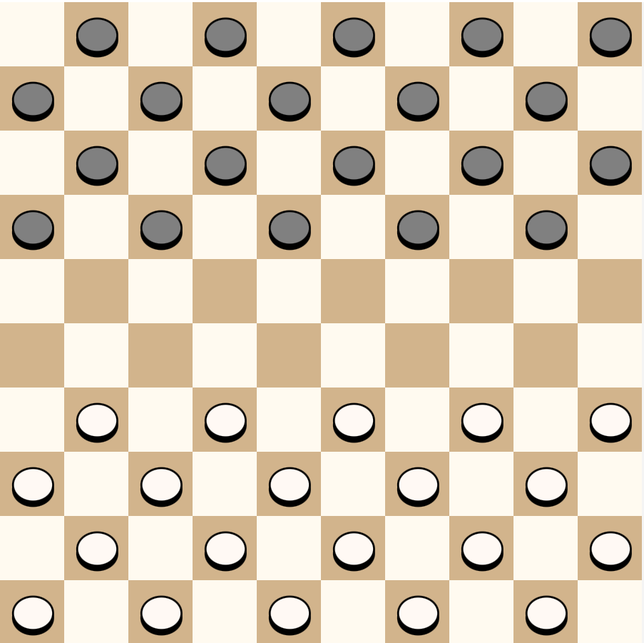
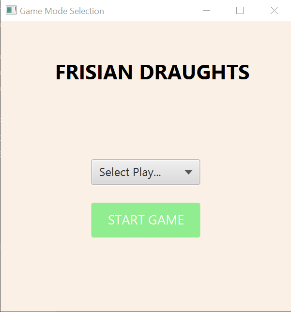
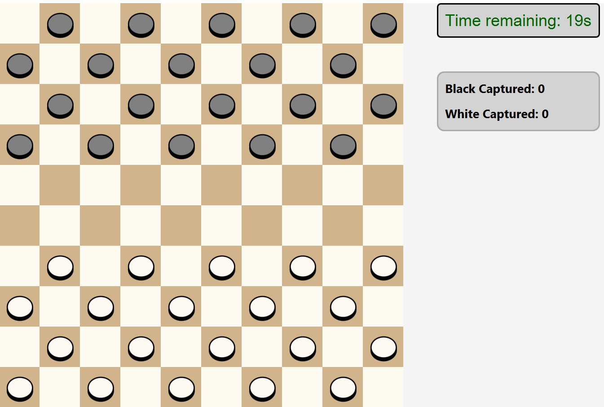

# Play it: Frisian Draughts

Our work on Project 2-1, academic course 2024/25  
@Maastricht University, Bsc. Data Science and AI

### _Note: To run the gameplay app, please execute the file `GUI.java` in the path src/main/java/org/testing/project_2_1_

## Preface  
This project aims to build a Java-based computer version of the board game
"Frisian Draughts", a variant of the classic game checkers, which originated in the north-eastern region of the Netherlands called Fryslân around 250 years ago (originally played on a 100-square board).  
For the intelligent player functionality, we will design, train and implement AI game-playing algorithms: One type of
adversarial search algorithm and one machine learning (ML) algorithm.  

## Rules  
A game of Frisian Draughts is played by two people on a 10x10 squares board, where only the darker squares are used for the game.  
Twenty (20) black pieces are displayed in the first 4 rows of the board, and twenty (20) white pieces are displayed in the bottom 4 rows of the boards, giving a maximum number of 40 pieces in total for a single game.  

We establish the allowed moves/captures, constraints and regulations based on the Official Rules for Frisian Draughts (2011), such as:
-   Each piece moves (forward) only one square diagonally
  - A piece can capture (and must capture in a situation possible piece-capturing) if and only if an enemy piece is placed within a radius of one square (any direction) and the following square is that direction is free (an empty square). 
  - A piece is promoted to king when: any piece reaches the opposite king row (which is the first row on the opposition side)
    - A king piece is allowed to make simple moves, but also is allowed to move diagonally to any empty square. 
    - A king can make regular captures, but is also allowed to capture any enemy piece (in any direction) if and only if its linearly-following square is empty.

## Project Structure  
The main class of this program is `CheckersApp.java`, which initializes and displays the primary scene, handles moves and capturing logic, king promotion, sets a timer for each turn and calls methods from other classes for other necessary functionalities.  
`GUI. java` is the class where the application shall be initiated. Sets the Main Layout design created which introduces a Home window, which allows the selection of the number of players before starting a game. Calls the main class CheckersApp.java  
Along that, there are some enums, helper and complementary classes:
- **Piece**: This class designs, defines the piece object and its playing constraints
  - And its helper enum **PieceType**, which list the different types of pieces (white, black, kings...)
- **Tile**: This class defines and sketches the Tile object for each individual square, in order generate the entire playing board.  
- **MoveResult**, which defines helps to define each Move itself as an object and its **MoveType** helper enum.
- **CapturedPiecesTracker**, helper class that handles the captured pieces counter for both black and white players and the labels assigned to it.

## Running the program  
As commented previously, after loading the .zip file this program should be executed on the class **GUI.java**  
This should launch a Homepage window where the player is asked to select the number of players (1/2) for this game. After selecting, the "Start Game" button executes the class CheckersApp and the Playing Screen is displayed, including the board and pieces, a timer for each player turn and a black and white pieces' captures tracker.  
Now it's time to _Play It_! (Frisian's version).
- In case its necessary, for better visualisation reasons, the Screen Size can be easily adjust by increasing/decreasing the value of the variable `int TILE_SIZE` in the CheckersApp class.

  
Homepage screen: Game mode selection.  
 
 

Gameplay Screen.  
